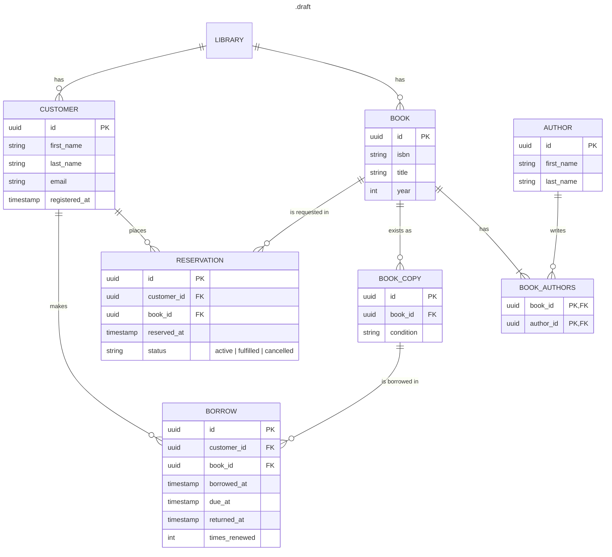

# Bookend

A book library backend. Written in Rust.

## About

This project...

### Features

...

### Restrictions

...

### Tools

- Axum -
- Tokio -
- Serde -
- sqlx -
- Tower-http -

## Getting started

### Prerequisites and Dependencies

...

### Installation

... (docker)

### Configuration

... (env)

### Running

...

### Running tests

...

## Documentation

### Database schema

### API

...

### Design decisions

**Database**
- A separate BOOK_COPY entry instead of a copy count on BOOK
    - allows per-physical-copy properties like *condition* (or shelf location, etc.)
    - each borrow references exactly one copy
- Reservations keep status instead of deletion on fulfill/cancel
    - allows misuse prevention (think of client reserving-cancelling multiple times)
    - allows analytics, if that is preferred.
- Junction table for AUTHOR and BOOK instead of author list on book
    - forced decision by many-to-many relationship

## Roadmap

...

## Authors

[Sky11y](https://github.com/Sky11y/)

## License

[MIT]

